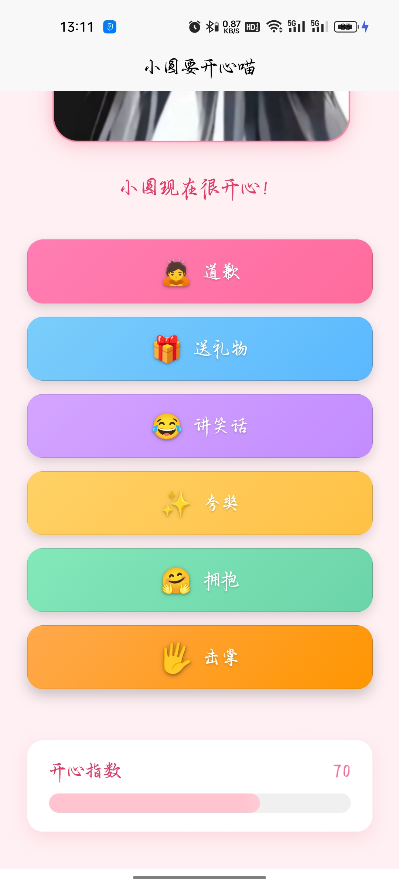

# 小圆要开心喵 😊✨

一个基于UniApp开发的互动类应用，通过各种互动方式让生气的npy开心起来！ （vibe coding）

## 📱 项目介绍

- （注:项目中的名字，图片，封面，图标请自行更改）
- 这是一款有趣的互动类应用，玩家可以通过点击不同的互动按钮（道歉、送礼物、讲笑话等）来提升npy的开心指数。随着开心指数的变化，npy的表情和状态也会相应改变，为用户带来轻松愉快的体验。

## 📸 项目预览


## 🎯 功能特点

- 🎭 **丰富的表情变化**：根据开心指数显示不同的表情状态（生气、中性、开心、兴奋）
- 🎮 **多种互动方式**：提供道歉、送礼物、讲笑话、夸奖、拥抱、击掌等多种互动选项
- ⭐ **彩蛋**：开心指数达到100时会触发“惹npy生气”的选项，但不会降低开心值
- 💖 **爱心粒子效果**：特定操作时触发爱心粒子动画
- 📊 **实时状态显示**：直观展示当前开心指数
- 📱 **多端适配**：支持iOS、Android、微信小程序等多平台运行

## 🛠 技术栈

- **前端框架**：UniApp
- **开发语言**：Vue 3
- **构建工具**：HBuilderX
- **样式处理**：SCSS

## 📦 安装与运行

### 前置条件

- 安装 [HBuilderX](https://www.dcloud.io/hbuilderx.html) 开发工具
- 安装 Node.js 环境
- 如需在移动端测试，建议安装相应平台的开发者工具

### 安装步骤

1. 克隆项目
```bash
git clone https://github.com/yourusername/AngryGirlfriend.git
cd AngryGirlfriend
```

2. 在 HBuilderX 中导入项目
   - 打开 HBuilderX
   - 点击「文件」>「导入」>「从本地目录导入」
   - 选择项目文件夹

3. 运行项目
   - 点击工具栏上的「运行」按钮
   - 选择运行到的目标平台（浏览器、模拟器或真机）

4. 打包app
   - 点击工具栏上的「发布」按钮
   - 选择云打包
   - 等待一小时左右即可

## 🚀 项目结构

```
AngryGirlfriend/
├── App.vue              # 应用入口组件
├── main.js              # 应用入口文件
├── manifest.json        # 应用配置文件
├── pages.json           # 页面路由配置
├── pages/               # 页面目录
│   └── index/           # 首页
│       └── index.vue    # 首页组件（核心功能实现）
├── static/              # 静态资源目录
│   ├── logo.png         # 应用Logo
│   ├── xiaoyuan.jpg     # 角色图片
│   └── xiaoyuan.png     # 角色图片
├── uni.scss             # 全局样式文件
├── LICENSE              # MIT许可证文件
└── README.md            # 项目说明文档
```

## 📝 开发说明

### 主要功能实现

应用的核心功能在于角色状态管理和互动反馈：

- 通过 `happinessLevel` 变量追踪角色开心程度
- 不同的互动按钮会触发相应的状态变化和文本反馈
- 根据开心指数动态显示不同的表情和视觉效果

### 添加新互动方式

如需添加新的互动功能，可以在 `index.vue` 文件中：
1. 在 `button-area` 中添加新的按钮组件
2. 在 JavaScript 部分实现对应的交互方法
3. 更新 `characterText` 和 `happinessLevel` 的变化逻辑

## 📜 许可证

本项目采用 MIT 许可证 - 查看 [LICENSE](LICENSE) 文件了解详情

MIT License 允许您自由使用、修改和分发本软件，无论是商业用途还是非商业用途，只要保留原始许可证声明即可。

## 📞 联系方式

如有任何问题或建议，请通过以下方式联系我们：

- GitHub Issues: [提交问题](https://github.com/yourusername/AngryGirlfriend/issues)
- QQ:2328441709
- 项目讨论: [GitHub Discussions](https://github.com/yourusername/AngryGirlfriend/discussions)

## ⚠️ 故障排除

### 常见问题

- **图片不显示**：检查图片路径是否正确，确保静态资源已正确放置在`static`目录下
- **应用无法启动**：确保已正确配置`manifest.json`和`pages.json`文件
- **样式异常**：检查是否正确引入和使用了SCSS变量

### 开发环境问题

- HBuilderX版本建议使用最新稳定版
- 运行前请确保已安装相关平台的SDK和开发工具

## 💡 项目目标

本项目旨在提供一个简单有趣的互动体验，同时也是学习UniApp跨平台开发的良好范例。我们希望通过这个项目，让更多开发者了解UniApp的开发流程和技巧。

## ⭐ 给个星支持一下

如果您喜欢这个项目，请给我们一个星标，您的支持是我们前进的动力！

---

> "让npy开心，世界更美好！" ✨
